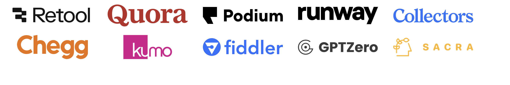

# Momentic Landing Page Copy v1

**HERO [Centered on the page, no hero image]**

# Test faster and ship without fear.

Our dev-centric AI testing tool runs on every push and never flakes, so you can ship faster without surprises

[Book a demo]

**SOCIAL PROOF**

### High-velocity teams run on trust. And Momentic.

**BENEFITS AND FEATURES**

## **QA you control and speed you can trust.**

### **Integrate automated testing into your flow**

Momentic connects with your CI/CD tools, GitHub, Slack, and more. Tests run  automatically on every push

### **Own QA and improve velocity**

Keep tests in code, cut the handoffs, and move faster with confidence.

### **Zero maintenance, zero flake**

Our AI adapts with your app, so tests don’t break. No brittle scripts. No constant upkeep.

### **Reliable at any scale**

Run thousands of tests in parallel. Debug with video replays and DOM snapshots. Meet enterprise-grade demands with secure, stable, production-ready QA.

**HOW IT WORKS**

## E2E speed and confidence in three simple steps.

### **Step 1:
Drop it into your workflow**

Install via npm and connect Momentic to your repo in minutes.

### **Step 2:
Write tests like you  code**

Cover key flows with clear, maintainable syntax. Our AI suggests improvements and adapts as your app evolves.

### **Step 3:
Get fast feedback on every push**

Every commit triggers a stable test run—so you catch real bugs, not noise.

**SOCIAL PROOF II**

## What today’s top teams are saying about Momentic:

> "Momentic makes it 3x faster for our team to write and maintain end to end tests.
> 

*- Alex, CTO, GPTZero*

> “Works for us in prod, super great UX, and incredible velocity and delivery.”
> 

*- Aditya, CTO, Best Parents*

> “…it was done running in 14 min, without me needing to do a thing during that time.”
> 

- Mike, Eng Manager, Runway

**CTA**

# Increase velocity with reliable AI testing.

Run stable, dev-owned tests on every push. No QA bottlenecks.

[Ship it]

**FAQ**

## FAQ: Fast answers for fast teams.

**How reliable is Momentic?**

Momentic tests are much more reliable than Playwright or Cypress tests because they are not affected by changes in the DOM.

**How fast can I build tests?**

It’s very easy to build tests using the low-code editor. You can also record your actions and turn them into a fully working automated test.

**Is there a big learning curve?**

Not even a little bit.

**Can you run against pull requests, merges, and commits?**

Yes. You can use Momentic's CLI to run tests anywhere. We support any CI provider that can run Node.js 20.

**Do you support mobile (iOS, Android) and desktop (Electron)?**

Mobile and desktop support is on our roadmap, but we don't have a specific release date yet.

**Do you support Chrome, Safari, and Firefox?**

We currently support Chromium and Chrome browsers for tests. Safari and Firefox support is on our roadmap, but we don't have a specific release date yet.

**FOOTER**

Benefits | Docs | Contact | Privacy